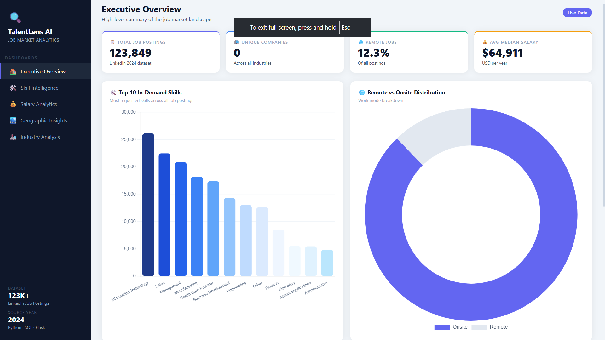
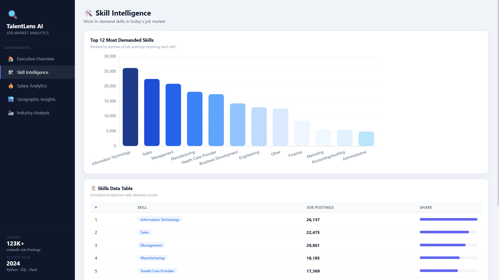
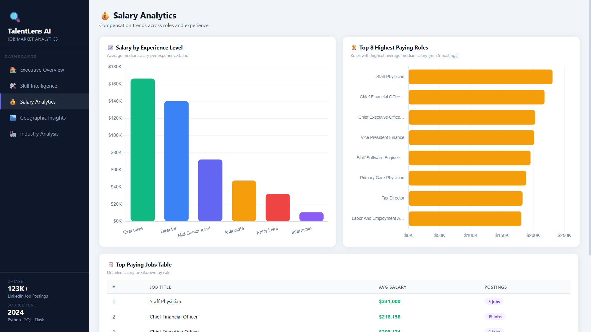
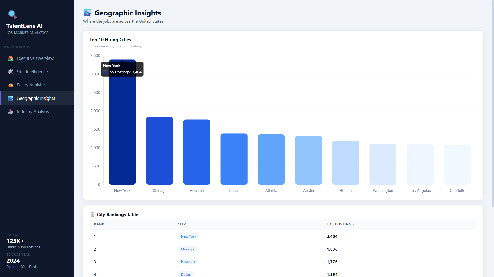
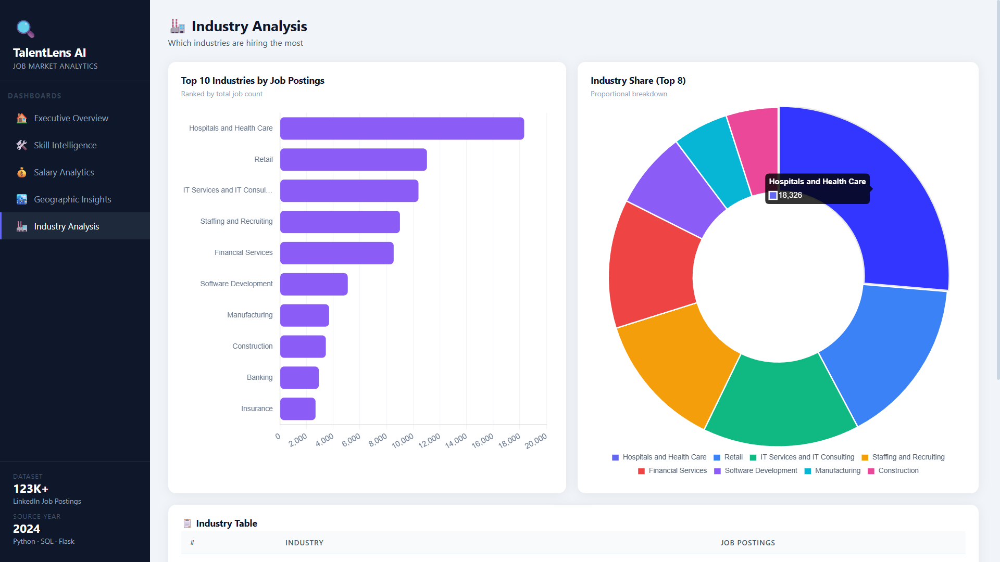

# 🔍 TalentLens AI — Job Market Analytics


> Analyzes 123,000+ LinkedIn job postings to uncover trending skills, salary patterns, hiring hotspots, and remote work trends — built with Python, SQL, Flask, and Chart.js.

---

## 📸 Dashboard Screenshots

### 🏠 Executive Overview


### 🛠️ Skill Intelligence


### 💰 Salary Analytics


### 🏙️ Geographic Insights


### 🏭 Industry Analysis


---

## 📊 Dashboard Pages

| Page | Description |
|------|-------------|
| 🏠 Executive Overview | KPIs + top-level market snapshot |
| 🛠️ Skill Intelligence | Most in-demand skills ranked |
| 💰 Salary Analytics | Salary by role & experience level |
| 🏙️ Geographic Insights | Top hiring cities across the US |
| 🏭 Industry Analysis | Industries ranked by job volume |

---

## 🧠 Key Findings

- 🥇 **Top Skill** — Information Technology (26,137 postings)
- 💰 **Highest Paying Role** — Staff Physician (~$231K avg salary)
- 🏙️ **Top Hiring City** — New York (3,404 jobs)
- 🌐 **Remote Work** — 12.31% of all postings
- 🏭 **Top Industry** — Hospitals & Health Care (18,326 jobs)
- 📈 **Executive Avg Salary** — $166,461/year

---

## ⚙️ Tech Stack

`Python` · `Pandas` · `MySQL` · `Flask` · `Chart.js` · `Matplotlib`

---

## 🚀 Run Locally

```bash
git clone https://github.com/dinesh15-hub/TalentLens-AI.git
cd TalentLens-AI
pip install -r requirements.txt
python server.py
```
Open `http://localhost:5000` in your browser.

---

## 🗄️ Database

7 relational MySQL tables — 700K+ total rows across jobs, companies, skills, salaries, and industries.

---

## 👨‍💻 Author

**Dinesh Chandra Reddy** · [@dinesh15-hub](https://github.com/dinesh15-hub)

---

⭐ If you found this project useful, please give it a star!
